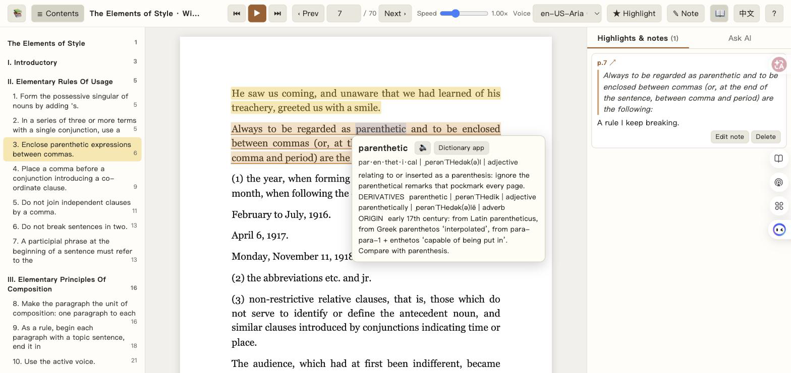

English | [中文](README.zh.md) | [日本語](README.ja.md)

# Read Smoother

**Read smoother: listen while you read.** Read Smoother is a small local web app that reads a PDF aloud, sentence by sentence, with Microsoft's neural voices, and keeps the sentence highlighted on the page as the voice moves. Hover a word for its dictionary entry. Press one key to send the sentence you love to your notes. Open a paper straight from your Zotero library. And ask your own AI what the sentence you are listening to means, right there on the page.

Its Chinese name is 畅读 (*chàngdú*): reading that flows.



## 🌱 Why Read Smoother exists

Read Smoother grew out of a very concrete problem: reading academic English with the eyes alone is slow. On a dense page attention drifts and the thread gets lost. Listening and reading at the same time helps, and that is more than one reader's habit. In second-language research, reading while listening improves comprehension and reading rate compared with reading alone (Chang & Millett, 2015) or listening alone (Chang, 2009), and new words stick better when they are read and heard together (Brown, Waring & Donkaewbua, 2008; Webb & Chang, 2012).

Screen readers and audiobook apps supply the voice, but not the rest of what reading needs: the text in front of the reader, a dictionary, a place for notes, and someone to ask when a paragraph will not open up. Read Smoother puts all of that on one page, wired to the tools researchers already live in (Obsidian and Zotero), with an AI that actually knows where the reader is in the book.

## ✨ What it does

- **Reads any text PDF aloud** with Microsoft neural voices (47 English voices; other locales configurable). Speed 0.6× to 2×. The current sentence is highlighted on the page and the page turns by itself. Sentences split across two pages are read as one.
- **Contents sidebar** from the PDF's bookmarks, or guessed from font sizes and weights when there are none (works well for journal articles). Click a heading and the voice jumps to it.
- **Hover a word** for half a second and a card shows its pronunciation and definition from the macOS dictionary (Oxford, and the Chinese-English Oxford if you have it enabled). Phrases are recognised as units: hover *spite* in "in spite of" and the whole phrase is explained; hover *drop* in "drop important people in" and the phrasal verb is offered.
- **Highlight and annotate** with one key. Each highlight becomes a quote in a Markdown note with your comment under it. The Markdown file is the single source of truth: edit the note in Obsidian and the page picks it up.
- **Zotero**: search your library by author, year, title or citekey, open the PDF, and the highlights go to that paper's `@citekey.md` note. No Zotero API needed, only the Better BibTeX auto-export you probably already have.
- **Ask your own AI** in a panel next to the page. It runs through your local [Claude Code](https://claude.com/claude-code) command line, so it uses your existing subscription and you choose the model (Haiku, Sonnet, Opus, Fable) from a dropdown. It always knows the sentence you are on and its neighbours, can search the whole book and cite page numbers, can read your notes and any local file you name, and reads a short profile you write about yourself so it knows who it is talking to. Every answer can be saved into the current sentence's note with one click.
- **Chinese or English interface**, switchable with one button.

## 🧠 An AI that knows where you are

Most "chat with your PDF" tools put the document in and let you type. Here the assistant sits beside the voice:

- The sentence you are listening to, plus two sentences either side and the current page, go with every question. Ask "what does this mean?" and it answers about *that* sentence. A quick-question button (and the `1` key) sends that question without typing.
- It has read-only search over the whole book, exported as page-marked text, so "where was this term introduced?" gets a page number instead of a guess.
- It can read the folders you list in `ai_read_dirs`, plus any path you paste into a question, so you can say "compare this with my notes on Smith 2019" or drop a file onto the box.
- `profile.md` is yours to write: who you are, what you work on, how you like things explained. It is injected into the system prompt and never leaves your machine except as part of that prompt.
- Conversations are per book and remembered between sessions; "New chat" clears the memory.

## 🗂 Obsidian and Zotero

Read Smoother writes plain Markdown. Point `vault_path` at your Obsidian vault and every book gets a note in `notes_folder`, every paper a note in `paper_notes_folder` named `@citekey.md`. If a note already exists (for example one created by the Obsidian Citations plugin), Read Smoother appends a "Highlights & notes" section and touches nothing else in the file. Inside that section each entry looks like this:

```markdown
%% hl:3f9a2c1e %%
> [!quote] p.42 [🆉](zotero://open-pdf/library/items/ABCD1234?page=42)
> The sentence you highlighted.

Your comment, which you can edit here or on the page.
```

The `%% ... %%` lines are invisible in Obsidian's reading view and tell Read Smoother which entry is which. Paper quotes carry a `zotero://open-pdf` link that jumps to the page in Zotero. The first-time header of a note comes from `templates/book_note.md` and `templates/paper_note.md`, which you can replace with your own (see `templates/README.md`).

For Zotero, Read Smoother reads the `.bib` file that Better BibTeX exports automatically, including each item's PDF path, so it works whether or not Zotero is running.

## 🚀 Getting started

Requirements: macOS (the dictionary and the desktop launcher use system features; the rest of the app is plain Python and should run elsewhere with the dictionary disabled, but it has only been tested on macOS), Python 3.10 or newer, an internet connection for the voices, Google Chrome if you want the app-style window, and [Claude Code](https://claude.com/claude-code) if you want the AI panel.

```bash
git clone https://github.com/cyresearch/read-smoother.git
cd read-smoother
cp config.example.json config.json     # then edit the paths
cp profile.example.md profile.md       # optional: tell the AI about yourself
./start.sh                             # creates .venv, installs deps, opens http://127.0.0.1:8765/
```

Try it on the bundled public-domain book before pointing it at your own files:

```bash
./start.sh demo/The-Elements-of-Style.pdf --title "The Elements of Style" --author "William Strunk Jr."
```

Add your own books by dropping PDFs into `books/` (they appear on the shelf) or with `./start.sh path/to/book.pdf --title "..." --author "..."`.

To get a double-clickable app with a Chrome window and no terminal:

```bash
osacompile -o ~/Desktop/"Read Smoother.app" app/read-smoother.applescript
cp app/icon.icns ~/Desktop/"Read Smoother.app"/Contents/Resources/applet.icns
```

Edit the `proj` line in the script first if you cloned the repository somewhere other than `~/projects/read-smoother`. The shelf page has a "Quit" button that stops the background server.

## ⚙️ Configuration

All keys live in `config.json` (start from `config.example.json`). Relative paths are resolved from the project folder; `~` is expanded.

| Key | What it is |
|---|---|
| `language` | `en` or `zh`. Default interface language and the language of the headings Read Smoother writes into notes. The interface can still be switched per browser. |
| `vault_path` | Folder that receives the notes, typically your Obsidian vault. Empty means `./notes`. |
| `vault_name` | The vault's name, used for `obsidian://` links. Empty disables the Obsidian button. |
| `notes_folder`, `paper_notes_folder` | Subfolders for book notes and paper notes. |
| `book_note_template`, `paper_note_template` | Markdown templates for the top of a new note. |
| `bib_path` | Better BibTeX auto-export of your Zotero library. Empty disables Zotero search. |
| `default_voice`, `tts_locales` | Default voice and which locales appear in the voice menu (for example `["en", "ja"]`). |
| `ai_read_dirs` | Folders the AI may read. Read-only; empty by default. |
| `profile_path` | Your profile for the AI. |

Runtime flags: `--port`, `--config other.json`, `--data-dir somewhere` (progress, highlights geometry and chats live there; default `./data`), `--no-browser`.

## 🔒 What leaves your machine

- **Sentences you play** are sent to Microsoft's text-to-speech endpoint through [edge-tts](https://github.com/rany2/edge-tts), which uses the same service as the Edge browser's read-aloud feature. It is not an official API. Audio is cached locally in `cache/`.
- **When you ask the AI**: your question, the current page's text, the sentence context, your `profile.md`, and anything the AI reads with its tools go to Anthropic through Claude Code. External connectors (MCP servers) are disabled for these calls; the AI has read-only file tools and nothing else.
- Dictionary lookups are offline. Zotero search reads a local file. Notes are local Markdown. There is no telemetry.

## ⌨️ Keys

| | |
|---|---|
| `Space` | play / pause |
| `←` `→` | previous / next sentence |
| `[` `]` | previous / next page (scrolling past the bottom also turns the page) |
| `H` | highlight the current sentence (again to remove) |
| `N` | write a note on the current sentence |
| `Shift` + click | highlight from the current sentence to the clicked one |
| `-` `=` | slower / faster |
| `T` `D` `A` | contents, dictionary on/off, focus the AI box |
| `1` to `9` | quick questions |

## 🔄 Still evolving

Read Smoother is under active development. Its author uses it every day for their own reading and keeps adjusting it to what that reading needs, so expect rough edges and changes. Issues and pull requests are welcome, especially reports of PDFs that break the sentence splitting or heading detection.

## 📚 References

Brown, R., Waring, R., & Donkaewbua, S. (2008). Incidental vocabulary acquisition from reading, reading-while-listening, and listening to stories. *Reading in a Foreign Language, 20*(2), 136–163.

Chang, A. C.-S. (2009). Gains to L2 listeners from reading while listening vs. listening only in comprehending short stories. *System, 37*(4), 652–663. https://doi.org/10.1016/j.system.2009.09.009

Chang, A. C.-S., & Millett, S. (2015). Improving reading rates and comprehension through audio-assisted extensive reading for beginner learners. *System, 52*, 91–102. https://doi.org/10.1016/j.system.2015.05.003

Webb, S., & Chang, A. C.-S. (2012). Vocabulary learning through assisted and unassisted repeated reading. *The Canadian Modern Language Review, 68*(3), 267–290. https://doi.org/10.3138/cmlr.1204.1

## License

[AGPL-3.0](LICENSE). Read Smoother depends on [PyMuPDF](https://pymupdf.readthedocs.io/) (AGPL-3.0), which is why the project uses the same licence. Other dependencies: [edge-tts](https://github.com/rany2/edge-tts) (LGPL-3.0), [PyObjC](https://pyobjc.readthedocs.io/) (MIT), and in the browser [PDF.js](https://mozilla.github.io/pdf.js/) (Apache-2.0), [marked](https://marked.js.org/) (MIT) and [DOMPurify](https://github.com/cure53/DOMPurify) (Apache-2.0 / MPL-2.0), loaded from cdnjs. The demo book is *The Elements of Style* (1918) from Project Gutenberg, public domain.
