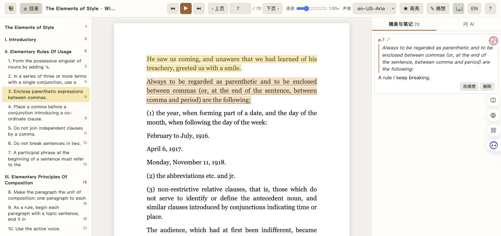

[English](README.md) | 中文 | [日本語](README.ja.md)

# 畅读 · Read Smoother

**读得更顺：边听边读。** 畅读是一个跑在本机的小网页应用：用微软的神经网络语音把 PDF 一句一句读给你听，正在读的句子在页面上跟着高亮。鼠标停在单词上就出释义；按一个键把喜欢的句子送进笔记；论文直接从 Zotero 库里打开；不懂的地方，就在这一页上问你自己的 AI，它知道你正听到哪一句。

英文名 Read Smoother，中文名「畅读」：读得顺畅。



## 🌱 为什么有畅读

畅读源于一个很具体的需求：读英文学术书和论文，光靠眼睛读很慢。一页信息密了，注意力就会飘，思路也跟着断。一边听一边看会好很多，而这不只是某个读者的习惯：二语阅读研究发现，边听边读比单纯默读更能提高理解和阅读速度（Chang & Millett, 2015），比只听更能帮助理解（Chang, 2009），生词在读和听同时出现时记得更牢（Brown, Waring & Donkaewbua, 2008；Webb & Chang, 2012）。

屏幕朗读器和有声书应用提供了声音，却没有阅读需要的其他东西：眼前的文本、一本词典、一个记笔记的地方，以及一段读不通时可以问的人。畅读把这些放在同一页上，接上研究者本来就在用的工具（Obsidian 和 Zotero），再配一个真的知道读者读到哪儿的 AI。

## ✨ 它能做什么

- **朗读任何文字版 PDF**，用微软神经网络语音（47 个英语声音，其他语言可配置），语速 0.6 到 2 倍。正在读的句子在页面上高亮，读完自动翻页；跨页的句子拼成一句读完。
- **目录栏**：用 PDF 自带的书签；没有书签就按字号和字重猜（对期刊论文效果很好）。点一个标题，朗读跳到那里。
- **悬停查词**：鼠标停在单词上半秒，卡片显示 macOS 自带词典的发音和释义（牛津词典，装了牛津英汉的话会给中文释义）。短语按整体识别：停在 in spite of 的 spite 上，解释的是整个短语；停在 drop important people in 的 drop 上，会提示短语动词。
- **一键高亮和写感想**。每条高亮变成 Markdown 笔记里的一段引用，感想写在下面。Markdown 文件是唯一来源：在 Obsidian 里改了，页面会读回来。
- **Zotero**：按作者、年份、题目或 citekey 搜自己的库，打开 PDF，摘录写进那篇论文的 `@citekey.md`。不需要 Zotero 的 API，只用你大概已经有的 Better BibTeX 自动导出。
- **问你自己的 AI**，就在页面旁边的面板里。它通过本机的 [Claude Code](https://claude.com/claude-code) 命令行运行，用的是你已有的订阅，模型（Haiku、Sonnet、Opus、Fable）从下拉框选。它始终知道你正在听哪一句和前后文，能翻整本书并注明页码，能读你的笔记和你点名的任何本地文件，还会读你写的一段自我介绍，知道自己在和谁说话。每条回答一键存进当前句的笔记。
- **中文或英文界面**，一个按钮切换。

## 🧠 一个知道你读到哪儿的 AI

多数「和 PDF 聊天」的工具是把文档丢进去然后打字。这里的助手坐在声音旁边：

- 你正在听的句子、它前后两句、当前整页，随每个问题一起发送。问「这句是什么意思」，它答的就是这一句。快捷问题按钮（和数字键 `1`）不用打字就能发这个问题。
- 它有整本书的只读检索（书导出成带页码标记的文本），问「这个术语最早在哪引入」得到的是页码，不是猜测。
- 它能读 `ai_read_dirs` 里列出的文件夹，以及你在问题里贴的任何路径，所以可以说「把这段和我关于 Smith 2019 的笔记对比一下」，或者把文件拖进输入框。
- `profile.md` 由你来写：你是谁、做什么、喜欢怎样的解释。它会注入系统提示词；除了作为提示词的一部分发给模型，不会离开你的机器。
- 对话按书保存，跨会话记住；「新对话」清空记忆。

## 🗂 Obsidian 与 Zotero

畅读写的是普通 Markdown。把 `vault_path` 指向你的 Obsidian 库，每本书在 `notes_folder` 里有一篇笔记，每篇论文在 `paper_notes_folder` 里有一篇 `@citekey.md`。如果笔记已经存在（比如 Obsidian Citations 插件建的），畅读只在末尾追加一节「摘录与感想」，文件里其他内容一字不动。这一节里每条长这样：

```markdown
%% hl:3f9a2c1e %%
> [!quote] p.42 [🆉](zotero://open-pdf/library/items/ABCD1234?page=42)
> 你高亮的那句话。

你的感想，在这里改或在页面上改都行。
```

`%% ... %%` 这两行在 Obsidian 阅读视图里看不见，是畅读认条目用的。论文的引用带一个 `zotero://open-pdf` 链接，点了 Zotero 直接翻到那一页。新建笔记的开头来自 `templates/book_note.md` 和 `templates/paper_note.md`，可以换成你自己的（见 `templates/README.md`）。

Zotero 这边，畅读读的是 Better BibTeX 自动导出的 `.bib` 文件，里面有每条文献的 PDF 路径，所以 Zotero 开不开都能用。

## 🚀 开始使用

需要：macOS（查词和桌面启动器用了系统功能；其余部分是纯 Python，理论上在别的系统也能跑，只是没了词典，而且目前只在 macOS 上测试过）、Python 3.10 以上、联网（语音）、想要独立窗口的话装 Google Chrome、想要 AI 面板的话装 [Claude Code](https://claude.com/claude-code)。

```bash
git clone https://github.com/cyresearch/read-smoother.git
cd read-smoother
cp config.example.json config.json     # 然后改里面的路径
cp profile.example.md profile.md       # 可选：告诉 AI 你是谁
./start.sh                             # 建 .venv、装依赖、打开 http://127.0.0.1:8765/
```

先用自带的公版书试试，再指向自己的文件：

```bash
./start.sh demo/The-Elements-of-Style.pdf --title "The Elements of Style" --author "William Strunk Jr."
```

加自己的书：把 PDF 放进 `books/`（会出现在书架上），或者 `./start.sh 路径.pdf --title "书名" --author "作者"`。

想要一个双击就开、带 Chrome 窗口、不用开终端的 App：

```bash
osacompile -o ~/Desktop/"Read Smoother.app" app/read-smoother.applescript
cp app/icon.icns ~/Desktop/"Read Smoother.app"/Contents/Resources/applet.icns
```

如果仓库不在 `~/projects/read-smoother`，先改脚本里 `proj` 那一行。书架页有「关闭畅读服务」按钮可以停掉后台服务。

## ⚙️ 配置

所有项都在 `config.json`（从 `config.example.json` 复制）。相对路径以项目文件夹为准，`~` 会展开。

| 键 | 含义 |
|---|---|
| `language` | `en` 或 `zh`。界面默认语言，以及写进笔记的标题语言。界面仍可在每个浏览器里单独切换。 |
| `vault_path` | 接收笔记的文件夹，一般是 Obsidian 库。留空则用 `./notes`。 |
| `vault_name` | 库的名字，用于 `obsidian://` 链接。留空则不显示 Obsidian 按钮。 |
| `notes_folder`、`paper_notes_folder` | 书笔记和论文笔记的子文件夹。 |
| `book_note_template`、`paper_note_template` | 新笔记开头的 Markdown 模板。 |
| `bib_path` | Zotero 库的 Better BibTeX 自动导出。留空则关闭 Zotero 搜索。 |
| `default_voice`、`tts_locales` | 默认声音，以及声音菜单里列哪些语言（比如 `["en", "ja"]`）。 |
| `ai_read_dirs` | AI 可以读的文件夹。只读，默认为空。 |
| `profile_path` | 给 AI 看的自我介绍。 |

运行参数：`--port`、`--config 别的.json`、`--data-dir 某处`（进度、高亮位置和对话存在那里，默认 `./data`）、`--no-browser`。

## 🔒 哪些数据会离开你的机器

- **你播放的句子**会通过 [edge-tts](https://github.com/rany2/edge-tts) 发给微软的语音合成接口，和 Edge 浏览器「大声朗读」用的是同一个服务，不是官方公开 API。音频缓存在本地 `cache/`。
- **问 AI 时**：你的问题、当前页文本、句子上下文、你的 `profile.md`、以及 AI 用工具读到的内容，会通过 Claude Code 发给 Anthropic。这些调用关闭了外部连接（MCP 服务器）；AI 只有只读的文件工具，没有别的。
- 查词完全离线；Zotero 搜索读的是本地文件；笔记是本地 Markdown。没有任何统计上报。

## ⌨️ 快捷键

| | |
|---|---|
| `空格` | 播放 / 暂停 |
| `←` `→` | 上一句 / 下一句 |
| `[` `]` | 上一页 / 下一页（滚轮滚过页底也会翻页） |
| `H` | 高亮当前句（再按取消） |
| `N` | 给当前句写感想 |
| `Shift` + 点击 | 从当前句到点的那句一起高亮 |
| `-` `=` | 慢一点 / 快一点 |
| `T` `D` `A` | 目录、取词开关、聚焦 AI 输入框 |
| `1` 到 `9` | 快捷问题 |

## 🔄 还在持续开发

畅读还在持续开发中。作者每天用它读自己的东西，会根据实际使用不断调整，所以会有粗糙的地方，也会有改动。欢迎提 issue 和 PR，尤其欢迎报告哪些 PDF 的断句或标题识别出了问题。

## 📚 参考文献

Brown, R., Waring, R., & Donkaewbua, S. (2008). Incidental vocabulary acquisition from reading, reading-while-listening, and listening to stories. *Reading in a Foreign Language, 20*(2), 136–163.

Chang, A. C.-S. (2009). Gains to L2 listeners from reading while listening vs. listening only in comprehending short stories. *System, 37*(4), 652–663. https://doi.org/10.1016/j.system.2009.09.009

Chang, A. C.-S., & Millett, S. (2015). Improving reading rates and comprehension through audio-assisted extensive reading for beginner learners. *System, 52*, 91–102. https://doi.org/10.1016/j.system.2015.05.003

Webb, S., & Chang, A. C.-S. (2012). Vocabulary learning through assisted and unassisted repeated reading. *The Canadian Modern Language Review, 68*(3), 267–290. https://doi.org/10.3138/cmlr.1204.1

## 协议

[AGPL-3.0](LICENSE)。畅读依赖 [PyMuPDF](https://pymupdf.readthedocs.io/)（AGPL-3.0），所以整个项目采用同一协议。其他依赖：[edge-tts](https://github.com/rany2/edge-tts)（LGPL-3.0）、[PyObjC](https://pyobjc.readthedocs.io/)（MIT），浏览器端的 [PDF.js](https://mozilla.github.io/pdf.js/)（Apache-2.0）、[marked](https://marked.js.org/)（MIT）和 [DOMPurify](https://github.com/cure53/DOMPurify)（Apache-2.0 / MPL-2.0）从 cdnjs 加载。演示书是 Project Gutenberg 的《The Elements of Style》（1918），公有领域。
